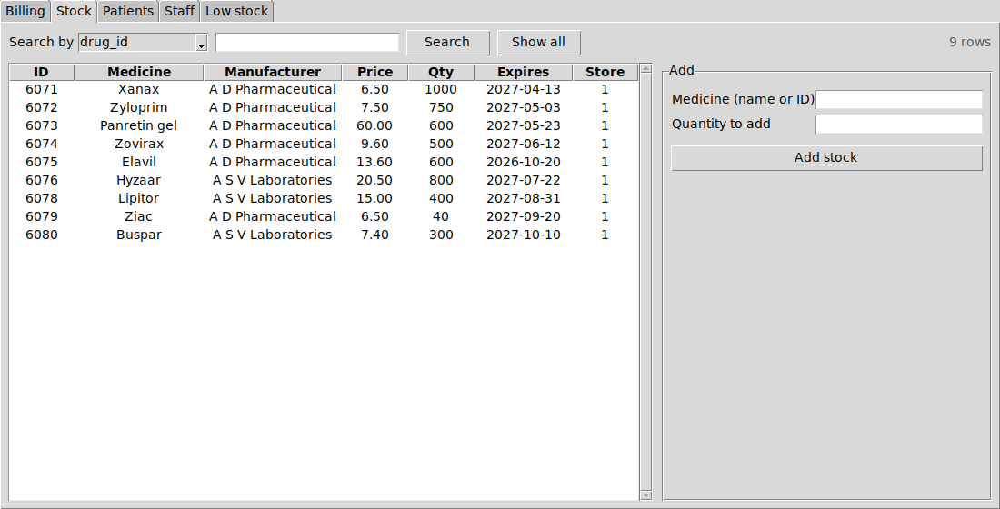
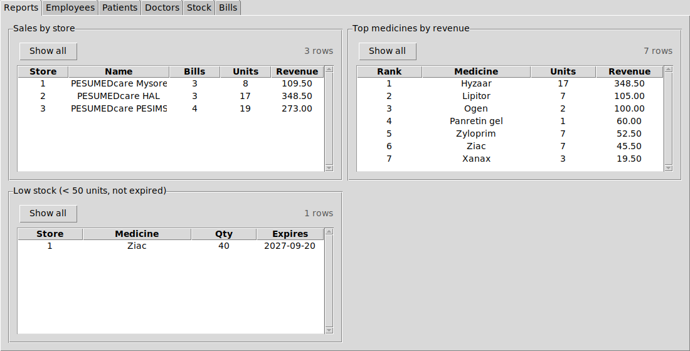

# Pharmacy Management System

A desktop app for a chain of pharmacies, built on **PostgreSQL** with a
**Tkinter** front end. Employees register patients, bill medicines and
restock their own store. Admins manage staff and see reports across the
whole chain. It started as a DBMS course project at PES University (2022).

| Employee view (stock of their store) | Admin view (reports) |
|---|---|
|  |  |

## Database design

Eight tables from the ER design in [`docs/report_final.pdf`](docs/report_final.pdf):

```
pharmacy ──< employee            doctor ──< patient >── pharmacy
    │                               │
    ├──< contains >── medicine      └──< associated_with >── pharmacy
    │                    │
    └──────< bill >──────┴── patient, doctor, employee
```

* **`contains`** holds the stock of each medicine in each store.
  **`associated_with`** says which doctors a store works with.
* Keys are identity columns, dates are `DATE`, money is `NUMERIC`. `CHECK`
  constraints reject bad data at the database: 10-digit phone numbers,
  6-digit PIN codes, positive prices, expiry after manufacture, and stock
  that never goes negative.
* Foreign keys cover every relationship, including all of `bill`'s
  references, with indexes on the columns used for joins and searches.

### Business rules live in the database (`sql/02_functions.sql`)

**`sell_medicine(patient, medicine, quantity, store)`** is the only way to
create a bill. In one transaction it:

1. locks the stock row with `SELECT … FOR UPDATE`, so two tills selling the
   last few units can't both succeed (there is a test for exactly this race)
2. refuses expired medicine, unknown patients or medicines, and quantities
   above the stock
3. takes the price from `medicine` (the client never sends an amount) and
   the doctor from the patient's record
4. decrements the stock and inserts the bill, recording which employee sold it

**`add_stock(store, medicine, quantity)`** is an upsert: it creates the stock
row if the store didn't carry that medicine yet.

**Reporting views**: `stock_view` (with expiry flags), `low_stock`,
`sales_by_store` and `top_medicines` (ranked with a window function).

### Roles and permissions (`sql/03_roles.sql`)

Each person logs in with their own PostgreSQL role, and access is enforced
by the server, not just the UI:

| | `pharmacy_admin` | `pharmacy_employee` |
|---|---|---|
| read all tables | ✓ | ✓, except `employee.salary` (column-level grant) |
| register patients | ✓ | ✓ (their own store) |
| sell / restock | ✓ any store | ✓ own store only, via the functions |
| edit stock or bills directly | ✓ | ✗ |

`current_store()` maps the logged-in role to its employee record. That's how
the app knows which store an employee works in.

## Running it

Requirements: PostgreSQL 13+ and Python 3.9+ with Tkinter.

```bash
pip install -r requirements.txt

# creates the database "pharmacy" and loads schema, functions, roles and sample data
PGUSER=postgres scripts/setup_db.sh

# create logins (as a superuser)
# an admin, and a login for employee 1001 (who works at store 1)
psql -U postgres -d pharmacy -c "CALL create_staff_login('admin1', 'change-me')"
psql -U postgres -d pharmacy -c "CALL create_staff_login('ramesh', 'change-me', 1001)"

python -m pharmacy               # --db / --host to override
```

## Tests

```bash
pip install -r requirements-dev.txt
PGUSER=postgres pytest
```

21 tests build a throw-away database from `sql/*.sql` and cover billing,
stock limits, expiry, the concurrent-sale race, role permissions, input
validation and SQL-injection attempts through the search box. GitHub Actions
runs them against a PostgreSQL 16 service container.

## Project layout

```
sql/01_schema.sql     tables, constraints, indexes
sql/02_functions.sql  sell_medicine, add_stock, current_store, reporting views
sql/03_roles.sql      group roles, grants, create_staff_login
sql/04_seed.sql       sample chain: 3 stores, 8 staff, 10 patients, 15 medicines
pharmacy/db.py        data-access layer used by the GUI and the tests
pharmacy/app.py       Tkinter GUI
tests/                pytest suite (needs PostgreSQL)
docs/                 design report and screenshots
```

## What changed from the course version

The first version was a single `main.py`. Several things were broken:

* **Adding a patient, employee or bill always failed**, because the primary
  keys were `INT NOT NULL` with no default and the app never supplied one.
  They are now identity columns.
* **Sales never reduced stock.** When stock stayed above zero, the bill was
  inserted but `contains` was left unchanged.
* **Stock was checked against the wrong store**: `WHERE drug_id = …` with no
  store filter. Restocking had the same bug.
* **Selling the last unit deleted the stock row**, so the medicine could
  never be restocked in that store.
* **The "current store" was the first row of `employee`**, not the store of
  the person logged in.
* Bill amounts in the sample data didn't match `price × quantity`, and all
  medicines expired in 2021.

Search columns are now whitelisted and quoted with `psycopg.sql.Identifier`.
Every value is passed as a query parameter.
